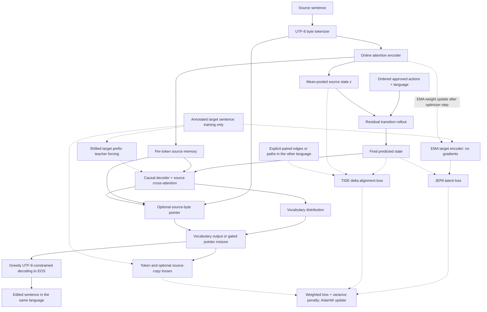
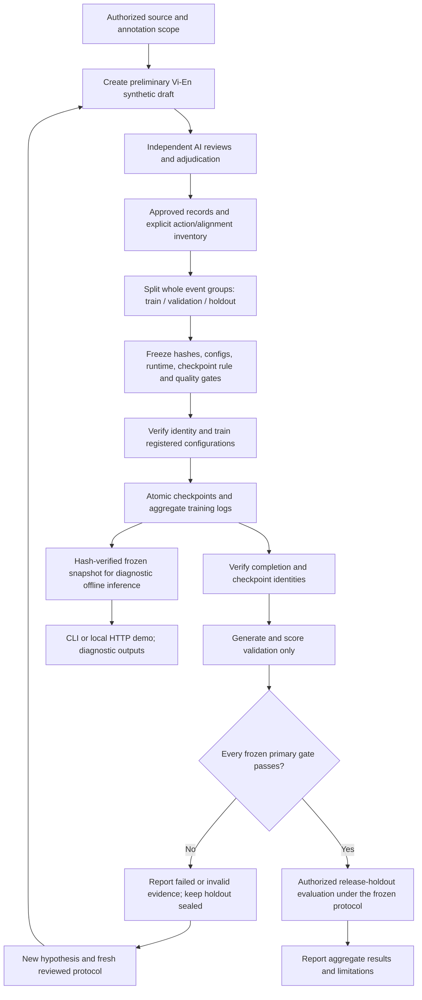

# TIDE-JEPA

Status snapshot, **2026-10-09**: v4.33 completed six frozen 58-epoch runs and passed corrected validation; after a hash-bound evaluator amendment, all three TIDE seeds passed the registered release-test buckets. The checker initially omitted the new event family; original metrics remain preserved and the unchanged generations were rescored. Token-only controls were similar and do not show a consistent TIDE advantage. The stock UI default was out of corpus and produced a corrupted output; the v4.33 runner now preloads a train-only example that passes the narrow checker. A two-reviewer Luna spot check of 48 stratified validation outputs found 47/48 acceptable for naturalness and 48/48 for meaning/action fidelity, with one spelling issue; it remains preliminary AI evidence, not human validation. Semantic OOD remains untested, so the checkpoint stays diagnostic-only. A fresh pinned-lock Linux snapshot passed 154 tests with zero skips; two varied train-only benchmark passes returned 40/40 HTTP 200 across both languages and single-action/two-action inputs, with unchanged RSS on the repeat. Overlapping clients receive schema-valid HTTP 503 under the one-inference limit. Evidence: [v4.33 status](VI_EN_RESULTS_V4.33_STATUS.md), [validation reassessment](audits/2026-10-08/v433_validation_checker_reassessment.json), [release holdout aggregates](audits/2026-10-08/v433_release_holdout_aggregate.json), [demo smoke](audits/2026-10-08/v433_demo_smoke.json), [AI review](audits/2026-10-08/v433_validation_ai_linguistic_review.json), plus [v4.32 failure history](VI_EN_RESULTS_V4.32_STATUS.md).

From-scratch research prototype for action-conditioned latent transitions and controlled generation. The current preliminary pilot covers **Vietnamese and English**; **Phan Rang Cham** is a planned language whose training/evaluation remains deferred pending permission and language review.

Read [the current specification](tide_jepa_spec.md) first. The [project decision ledger](Obsidian/RMIT%20Hackathon/wiki/Project%20Ground%20Truth.md) records user authority. Earlier MATE-JEPA/La Ha proposals are superseded drafts.

Current data-source findings and the PhoMT permission record are in [Dataset Research — 2026-09-30](Obsidian/RMIT%20Hackathon/wiki/Dataset%20Research%20%E2%80%94%202026-09-30.md). PhoMT is conditionally approved for the requested research/education scope; its local archive now passes the supplied SHA-256 and metadata audit. It has not been used for model training.

The user-authorized **preliminary AI-reviewed English–Vietnamese synthetic pilot** now passes its narrow synthetic gate in v4.33, but this is not human validation or research-efficacy evidence; the new small AI review found one spelling issue and does not establish natural-corpus naturalness. The offline demo is explicitly diagnostic-only and does not classify semantic OOD inputs. PhoMT was not used. Phan Rang Cham remains deferred pending data-use permission and language/community review. Earlier results and the v4.27/v4.28 review incidents remain in [results](VI_EN_RESULTS.md), [history](VI_EN_RESULTS_HISTORY.md), [pilot workflow](VI_EN_PILOT.md), and [research acceleration](RESEARCH_ACCELERATION.md). Agent creation follows the Luna-only requirement in [AGENTS.md](AGENTS.md).

## How the model works

TIDE-JEPA learns to edit a sentence according to explicit semantic actions while preserving the rest of its meaning. A request supplies the source sentence, its language, and an ordered list of approved actions such as `TIME:PAST` and `POLARITY:NEGATIVE`. The offline adapter currently requires source and target languages to match. Cross-language alignment is a training objective; it does not expose a translation feature.

For illustration only, an original example is `Lan buys a book.` with actions `TIME:PAST` then `POLARITY:NEGATIVE`. The intended result is `Lan did not buy a book.`: tense and polarity change, while the person, predicate, and object remain. This is an explanation of the task, **not an observed model output or a corpus row**.

1. **Encode the source.** A fixed UTF-8 byte tokenizer uses 256 byte IDs plus PAD/BOS/EOS, for 259 tokens. The online encoder adds token and position embeddings, applies attention blocks, and mean-pools nonpadding positions into a sentence vector `z`. It also retains the per-token vectors as source memory for the decoder.
2. **Predict the edited meaning.** Learned action and language embeddings condition a residual transition network: `z_next = z + transition(concat(z, action_embedding, language_embedding))`. For a path, each action consumes the previous predicted vector in the supplied order. The system decodes the final vector; it does not generate and re-encode an intermediate sentence for every action.
3. **Learn a target representation during training.** A separate target encoder reads the annotated target sentence without gradients. Its weights follow the online encoder through an exponential moving average (EMA). A JEPA loss brings the predicted vector toward this teacher vector. The teacher supplies a slowly changing training target and is not used to read a reference sentence at inference.
4. **Generate the edited sentence.** A causal decoder conditions on the final predicted vector and language embedding, attends to source memory, and predicts the next byte token. Training uses the annotated prefix (teacher forcing); inference feeds back its own greedy predictions. An optional source-pointer decoder mixes the vocabulary distribution with a distribution over byte tokens in the input, using a learned gate. Copying bytes does not itself guarantee preservation of words or meaning.
5. **Align changes across languages.** For explicitly approved corresponding Vietnamese/English edges, TIDE compares `predicted_state - source_state` across languages. It applies the same principle to paired complete action paths. This encourages a shared representation of the *change* rather than requiring identical sentence forms. Alignment pairs must be declared; neither batch position nor a translation link creates an action label.

The main components are in [model.py](tide_jepa/model.py), the losses and optimizer step in [training.py](tide_jepa/training.py), and request validation and generation in [infer.py](tide_jepa/infer.py).

### Model workflow

Solid arrows show the source-to-output computation and training-loss inputs. Dotted arrows show training-only teacher and cross-language supervision. The teacher branch and losses are absent during inference.



### What is optimized

All objective modes share the action-conditioned generator and single-action/path text supervision. They differ in which auxiliary losses are enabled:

| Mode | Additional learning signal |
|---|---|
| `token_only` | No JEPA, latent alignment, or variance penalty; optional source-copy loss still follows the config. |
| `generic_jepa` | Predict the teacher's target vector for single actions and composed paths; penalize low latent variance. |
| `static_alignment` | JEPA terms plus alignment of paired predicted final states across languages. |
| `tide` | JEPA terms plus alignment of paired transition deltas across languages, for edges and paths. |

The weighted total combines the base per-edge next-token cross-entropy, composed-path token loss, optional source-copy token loss, JEPA edge/path losses, cross-language edge/path alignment, and a variance penalty intended to discourage collapsed source representations. An optional language-balance weight interpolates the base per-edge term between global token-weighted CE and a per-example token-normalized CE averaged within language and equally across languages; composed-path token CE and auxiliary terms stay unchanged. Disabled terms contribute zero. The source-copy loss adds weight to annotated aligned target-byte positions; it is separate from the optional pointer decoder. AdamW updates trainable parameters with gradient clipping; the teacher then receives its EMA update.

The v4.21 study crosses source-copy weights **0 / 1.5** with **vocabulary / source-pointer** decoders across seeds **17 / 23 / 41**. It uses width 32, four heads, one layer, a 192-token limit, and 29 fixed epochs. Decoder compute differs between cells, so this is not a matched-FLOP comparison. See the [frozen protocol summary](VI_EN_RESULTS_V4.21_STATUS.md).

### Experiment workflow



The checkpoint rule is frozen before training; v4.21 used the final epoch rather than validation-based checkpoint selection. Validation loss monitoring during training is separate from generated-text validation scoring. Checkpoint provenance failures stop replay; quality failures stop release-holdout scoring. Diagnostic inference does not bypass these gates or constitute a quality approval. Corpus rows, reviews, checkpoints, and generated text stay in ignored `data/` and `runs/`; GitHub receives code, documentation, and aggregate evidence.

### What the evidence currently supports

The software supports reproducible experiments and diagnostic inference. v4.33 passed its narrow corrected synthetic gate, but the stock UI default was out of corpus and corrupted; the amended runner uses a train-only example. Token-only is similar and no natural-language model or TIDE advantage is established. v4.20–v4.32 failures remain in the historical reports. Linux CPU test, compile, dependency, and probe evidence is recorded in the [audit closure](audits/2026-10-02/REPAIR_CLOSURE.md). Those checks verify software behavior, not linguistic quality.

## Current implementation: action-path composition

The prototype now supports ordered paths containing multiple licensed semantic-action edges. It rolls the transition predictor forward, predicts the final EMA-teacher state, trains the decoder from that composed state against the final target text, and can align composed transition deltas across explicitly paired languages. `generate_path` exposes the same ordered rollout at inference. This is still infrastructure, not a trained language system or evidence of research benefit.

The original, small PyTorch implementation of masked attention, an encoder, typed action transitions, a frozen EMA target encoder, and a causal decoder remains the shared architecture. Objective controls are `token_only`, `generic_jepa`, `static_alignment`, and `tide`; all controls receive the same path-level text-generation supervision, JEPA controls additionally predict the terminal latent state, and static/TIDE alignment additionally use explicitly licensed cross-language path pairs.

An `EdgePath` is an ordered chain of at least two single-action edges in one language. Consecutive semantic frame IDs must connect. A `PathPair` can align paths only when the same complete frame chain and action sequence are explicitly licensed across different languages. Batch position never implies a correspondence. Human-provided metadata is still an assertion that requires evidence; the code cannot validate a speaker's judgment.

No external source code, tokenizer, checkpoint, or dataset is included. PyTorch is the only runtime dependency. Token IDs and approved action inventories are supplied by callers; no Phan Rang Cham orthography or grammar is assumed. PhoMT is approved conditionally as a private Vietnamese–English source; no PhoMT archive is in the repository, and no Phan Rang Cham corpus is approved.

## Milestone 3: reproducible data foundation

`tide_jepa.data` now defines a versioned JSONL transition record, checks declared provenance/license and per-language action approval before experimental splitting, assigns whole `split_group_id` groups deterministically to train/validation/test, writes a SHA-256-addressed split manifest, and converts approved records to validated padded TIDE-JEPA batches. A fixed UTF-8 byte tokenizer maps normalized Unicode to a 259-token vocabulary, so it has no fitted vocabulary or unknown-character bucket. This prevents tokenizer-vocabulary OOVs but can make sequences longer; it is an infrastructure baseline, not a claim that byte encoding improves linguistic accuracy.

Every record has `approval_status`; loaders and grouped splitting reject anything except `approved` by default. That flag is a workflow guard, not proof that the license is legally sufficient. The team must verify source terms, consent, and Cham community/expert approval. Tests use only synthetic records. The separate preliminary pilot has AI review evidence and explicitly records `human_validated=false`.

## PhoMT intake — M4 data annotation gate remains open

The PhoMT author has confirmed the project scopes in writing, conditioned on research/education-only use, no redistribution of any original or modified dataset material, citation of the EMNLP 2021 paper, and a non-commercial license for any released model weights. The Hugging Face repository is gated and requires account login plus acceptance of its access conditions; no login or legal terms were accepted by Codex. After you complete that access step, put the official archive at `data/raw/phomt/PhoMT.zip`. The whole `data/` directory, run outputs, and model checkpoints are Git-ignored.

The local archive has completed a metadata-only audit without member decompression. Run that mode with:

```powershell
py -3.11 -B -m tide_jepa.phomt_audit data/raw/phomt/PhoMT.zip
```

The audit hashes the archive and checks ZIP paths/sizes without extracting it or deserializing pickle members. `--verify-crc` is optional and streams/decompresses members; it was not used for the initial metadata-only audit. Private source selection has prepared 160 pending train-only packets; no translation link was assigned an action label. See [the pilot workflow](VI_EN_PILOT.md) and [the M4 roadmap](ROADMAP.md#milestone-4--approved-pilot-corpus-and-preregistered-benchmark).

## Verified CPU test setup (Windows)

The verified runtime is Python 3.11 with the official `torch==2.14.0+cpu` wheel from PyTorch's CPU package index. From the repository root in PowerShell, create a local environment on a fresh checkout and install the [CPU test requirements](requirements-test-cpu.txt):

```powershell
py -3.11 -m venv .venv
.\.venv\Scripts\python.exe -m pip install -r requirements-test-cpu.txt
```

The `.venv` directory is ignored by Git. If it already contains this runtime, use it directly; activation is unnecessary. `requirements-test-cpu.txt` pins PyTorch and its CPU channel; use `requirements-lock-linux-py311-cpu.txt` when exact transitive versions are required.

Run the checks with that environment:

```powershell
.\.venv\Scripts\python.exe -m unittest discover -s tests -v
.\.venv\Scripts\python.exe -m compileall -q tide_jepa tests
```

Verified by the independent scheduled review on 2026-09-29: **all 18 tests passed on CPU, with 0 skipped**, including the action-path tests, using the project-local `.venv` with Python 3.11.9 and PyTorch `2.14.0+cpu`. The review ran `.\.venv\Scripts\python.exe -B -m unittest discover -s tests -v` with `PYTHONDONTWRITEBYTECODE=1`. CUDA was unavailable, and the review did not run `compileall`. This successful run supersedes the earlier report that the local environment could not launch and action-path tensor verification was pending. Synthetic integer IDs are not linguistic examples or Cham data. These CPU checks do not establish GPU compatibility, GPU performance, or research efficacy.

For a dependency-free schema check, `python -m unittest discover -s tests -v` also works with Python 3.10+: tensor tests explicitly skip if PyTorch is absent. A run with skips does not verify the tensor implementation.

The M1/M2 18-test CPU suite passed again on 2026-09-29 after strengthening action-path assertions. After completing M3, the full suite passed **29 tests, 0 skipped** on Python 3.11.9 with PyTorch `2.14.0+cpu`; `compileall` and `pip check` passed. In this shell the installed interpreter loaded Torch from the project `.venv` because its launcher intermittently failed to spawn the base interpreter. No GPU or real-language evaluation was run.

Future GPU training requires the user's device/driver-matched official PyTorch build, selected from [PyTorch's installation guide](https://pytorch.org/get-started/locally/), with separate verification on that device. `requirements-test-cpu.txt` deliberately selects a CPU-only wheel and is not the GPU training setup. No CUDA installation or GPU performance claim is included in this milestone.

## Verified CPU setup (Linux)

From the repository root on Linux with Python 3.11, create a clean environment and install the CPU requirements:

```sh
python3.11 -m venv .venv
.venv/bin/python -m pip install -r requirements-test-cpu.txt
PYTHONDONTWRITEBYTECODE=1 .venv/bin/python -B -m unittest discover -s tests -v
.venv/bin/python -B -m compileall -q tide_jepa tests audits/2026-10-02/root_probes.py
.venv/bin/python -m pip check
```

For a pinned Linux CPU test environment, use the resolved lock instead of resolver-selected transitive packages:

```sh
python3.11 -m venv .venv
.venv/bin/python -m pip install -r requirements-lock-linux-py311-cpu.txt
PYTHONDONTWRITEBYTECODE=1 .venv/bin/python -B -m unittest discover -s tests -v
.venv/bin/python -B -m compileall -q tide_jepa tests audits/2026-10-02/root_probes.py
.venv/bin/python -m pip check
```

Verified on 2026-10-06 from a clean tracked-source archive of commit `925acb1` with a newly created virtualenv and `torch==2.14.0+cpu`: **96 tests passed, 0 skipped**, `compileall` passed, and `pip check` found no broken requirements. The source archive contained no ignored `data/` or `runs/` artifacts. The full suite includes loopback HTTP tests and therefore needs local loopback binding. On 2026-10-08 the current lattice checkout passed **150 tests, 0 skipped**, plus `compileall`, `pip check`, the synthetic root probe after run-manifest writer correction, and `git diff --check`. Four review-summarizer regression tests were added later; the refreshed **219-source-file** snapshot passed the complete **154-test** suite with zero skips, `compileall`, and `pip check` in a newly created virtualenv installed from the pinned lock. See the [2026-10-09 final source-only reproduction report](audits/2026-10-09/linux-source-only-final-reproduction.json), [audit closure](audits/2026-10-02/REPAIR_CLOSURE.md), and [original lock-bootstrap evidence](audits/2026-10-08/linux-lock-bootstrap.json). The refreshed snapshot came from the current uncommitted working tree and excludes `.git`, `.venv`, `data/`, and `runs/`; this is not a clean commit or OS image. CUDA remains unverified.

## Frozen diagnostic demo

Current troubleshooting evidence is in [the 2026-10-06 repair report](audits/2026-10-06/TROUBLESHOOTING.md). For a frozen pilot checkpoint, run its original verified source snapshot so later workspace edits do not invalidate inference provenance:

```sh
.venv/bin/python -B scripts/run_frozen.py data/pilot/vi-en-ai-v4.20 demo data/pilot/vi-en-ai-v4.20/tide-aux-0p0-decoder-source_pointer-copy-0p0-seed-17.json runs/vi-en-ai-v4.20/tide-aux-0p0-decoder-source_pointer-copy-0p0-seed-17/best.pt --port 8765
```

For v4.33, launch the [amendment-aware diagnostic demo](scripts/run_v433_demo.py); it verifies the corrected validation evidence and frozen checkpoint identity, binds loopback only, allows only exact approved train source/action combinations, and reports `diagnostic_only`. The old stock-page example was out of corpus and produced semantic corruption; the current train-only example passes the narrow checker. Two five-minute sequential soaks (3,132 and 3,219 requests), burst/incomplete-body handling, delayed stale-response browser checks, and two bounded 240-request latency/RSS runs passed. The two sequential benchmark runs returned 240/240 successful requests and sampled 85,520 KiB RSS. A separate 4-client/80-request test ran twice: the one-inference limit served one request and returned schema-valid HTTP 503 for the 79 overlapping requests each time; RSS increased 112 KiB in the repeat after an initial 1.6 MiB warm-up. See [concurrency run 1](audits/2026-10-09/v433_demo_concurrent_bound.json) and [run 2](audits/2026-10-09/v433_demo_concurrent_bound_repeat.json). A separate sequential varied-input test used 40 requests per pass from 64 exact approved train candidates (both languages, single actions and two-action paths); both passes returned 40/40 HTTP 200 and passed the narrow checker in all four language/task cells (10/10 each); RSS was unchanged on the first pass and increased 4 KiB in the repeat. See [varied run 1](audits/2026-10-09/v433_demo_varied_quality_benchmark_1.json) and [run 2](audits/2026-10-09/v433_demo_varied_quality_benchmark_2.json). This is synthetic train-only evidence; natural-corpus performance and production capacity remain unverified. Broad semantic OOD and naturalness also remain unverified, so do not use this checkpoint for translation or natural-language production. Reproduce the bounded benchmark (the output path must be new) with:

```sh
.venv/bin/python -B scripts/benchmark_v433_demo_runtime.py --port 8765 --requests 240 --output /tmp/v433-demo-runtime-recheck.json
```

To reproduce the bounded overload check, use the approved page-default request only. The port must belong to the v4.33 runner, and the report path must be new:

```sh
.venv/bin/python -B scripts/benchmark_v433_demo_runtime.py --port 8765 --requests 80 --workers 4 --output /tmp/v433-demo-concurrent-recheck.json
```

To exercise varied approved train inputs without recording their text, use the explicit v4.33 config and `--vary-approved`:

```sh
.venv/bin/python -B scripts/benchmark_v433_demo_runtime.py --port 8765 --requests 40 --workers 1 --vary-approved --output /tmp/v433-demo-varied-train-recheck.json
```

Recheck the exact allowlist and HTTP boundaries; the aggregate-only report covers 19 expected accepted/refused request classes, not a semantic OOD classifier:

```sh
.venv/bin/python -B scripts/smoke_v433_demo_boundaries.py --port 8765 --output /tmp/v433-demo-boundary-recheck.json
```

In PowerShell, pass explicit `-Config` and `-Checkpoint` paths to `scripts/run_vi_en_demo.ps1`; that older launcher uses the frozen snapshot path.

The Python test suite requires loopback access for its HTTP tests. Run the isolated UI behavior checks separately with `node tests/demo_ui.test.js` when Node.js is available; Node.js is a development check, not a model runtime dependency.

## Layout

For current research bottlenecks, v4.33 corrected validation/release results, and the next evidence gates, see [Research acceleration](RESEARCH_ACCELERATION.md). The parallel trainer checks the exact frozen checker on train-reference negative controls before launching scoped review-bundle matrices. The historical v4.30 checker fails that preflight; its completed runs retain their original identities and its release holdout remains sealed.

- `tide_jepa/config.py`: language registry and model sizes.
- `tide_jepa/data.py`: versioned corpus rows, UTF-8 byte tokenizer, approval gate, grouped splits, and fingerprints.
- `tide_jepa/schema.py`: typed actions and explicit licensing of comparable transition edges.
- `tide_jepa/model.py`: original attention, encoder, predictor, and autoregressive decoder.
- `tide_jepa/training.py`: shared trainer and objective controls.
- `tide_jepa/experiment.py`: approval-gated runner, grouped batches, metric logs, explicit alignment loading, and atomic checkpoints.
- `tests/`: standard-library unit tests, with optional PyTorch execution.

The full-batch/experiment runner, checkpointing, deterministic grouped batching, split fingerprints, and train/validation accounting are now implemented. Real-language empirical training still needs an approved corpus; matched-FLOP scheduling, human evaluation, and hackathon task integration remain future work. The included tokenizer and corpus contract do not bundle a corpus. Caller-supplied approval and license references are assertions requiring real evidence; the code cannot validate a speaker's judgment.

## Experiment runner

`python -m tide_jepa.experiment path\to\run.json` runs a configured experiment on a corpus that has already passed source-rights and language-review checks. It refuses records without `approval_status: "approved"`; it does not fetch or approve data. Batches keep every `split_group_id` intact, so aligned translations and multi-edge paths cannot be divided between optimizer steps. The runner writes the split manifest, resolved config and hashes, per-epoch train/validation metrics, and atomic `latest.pt` / `best.pt` checkpoints. It logs examples, UTF-8 byte-token counts, updates, wall time, throughput, and peak allocated VRAM. `--resume` continues only when the config, corpus, split, action inventory, and alignment hashes match.

The held-out test split is reserved and fingerprinted but is not evaluated during training or checkpoint selection. Frozen pilots must use `python -m tide_jepa.pilot evaluate <pilot-directory> --evaluation-split validation` first; release-holdout evaluation is refused unless every registered primary validation gate passes. The lower-level experiment runner also exposes `--resume --evaluate-test`, which loads `best.pt` under the configured checkpoint rule and writes `test_metrics.json`; it is not a substitute for the pilot's suite-level quality guard. Do not use test results to change the model or protocol. FLOPs are not estimated; wall time, updates, token counts, examples, throughput, and peak allocated VRAM are recorded. Cross-language losses are enabled only by an optional explicit alignment JSON whose pairs refer to records/paths in the same semantic split group. A blank or missing alignment file never implies a cross-language pair.

An experiment config points to a corpus JSONL, an inventory JSON, and an output directory. The inventory format is:

```json
{
  "actions": [{"kind": "POLARITY", "value": "NEGATIVE"}],
  "approved_by_language": {
    "vi": [{"kind": "POLARITY", "value": "NEGATIVE"}],
    "en": [{"kind": "POLARITY", "value": "NEGATIVE"}],
    "cham_phan_rang": []
  }
}
```

The Cham list stays empty until Cham speakers and a qualified linguist approve a task-specific inventory. A minimal run config is:

```json
{
  "corpus": "approved-pilot.jsonl",
  "inventory": "inventory.json",
  "output_dir": "runs/tide-seed-1",
  "seed": 1,
  "split": {"train": 0.8, "validation": 0.1, "test": 0.1},
  "model": {"width": 64, "heads": 4, "layers": 2, "max_length": 512},
  "objective": {"mode": "tide"},
  "training": {"epochs": 20, "batch_size": 32, "learning_rate": 0.001}
}
```

Use `"alignments": "alignments.json"` to enable separately reviewed pairs. Its `edge_pairs` entries identify `left_record_id`, `right_record_id`, and optionally `relation: "same_event"`; `path_pairs` entries identify each side with `path_id` and `language`, plus the same relation. Pairs must share a `split_group_id`. Run with `python -m tide_jepa.experiment run.json`; resume with `python -m tide_jepa.experiment run.json --resume`. Configs and corpus paths are relative to the config file.

For offline inference with a trained checkpoint, run `python -m tide_jepa.infer run.json runs/tide-seed-1/best.pt`. Send one JSON request per line on stdin, for example `{"request_id":"demo-1","source":"Lan mua một quyển sách.","source_language":"vi","target_language":"vi","actions":[{"kind":"TIME","value":"PAST"},{"kind":"POLARITY","value":"NEGATIVE"}],"max_new_tokens":96}`. Responses are JSONL and include generated text, token IDs, and a UTF-8 validity flag. The adapter checks the language's approved action inventory and supports single actions or ordered action paths. Its responses are diagnostic preliminary outputs; they do not establish linguistic correctness or human validation.

This runner makes training executable, not scientifically validated. v4.33 passes its narrow synthetic gate after a checker amendment, but the local demo remains diagnostic-only and no natural-language use is approved. v4.27 was retired after test-split exposure during review, and v4.28 after holdout annotations were accessed; both remain incident evidence. See [v4.33 status](VI_EN_RESULTS_V4.33_STATUS.md), [historical results](VI_EN_RESULTS_HISTORY.md), [research acceleration](RESEARCH_ACCELERATION.md), and the [audit closure](audits/2026-10-02/REPAIR_CLOSURE.md). The v4.8 artifact hashes match the handoff status, but its Windows runtime differed from lattice Linux, so it was not resumed. No natural-corpus or human linguistic evidence exists. PhoMT-derived action annotations and the human-validated benchmark remain unfinished.
