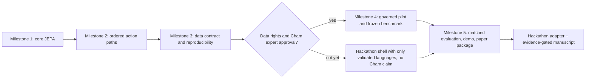

# TIDE-JEPA: three milestones from prototype to paper/demo readiness

Status date: 2026-10-08. Milestones 1–3 and the preliminary AI-reviewed Vi–En engineering workflow are implemented. v4.29 completed six frozen runs but failed validation (1/6 configurations; 37/60 seed-by-bucket checks). v4.30 completed six runs and validation (1/6 configurations; 29/60 buckets by its frozen checker), but a negative-control audit showed that checker accepts Vietnamese progressive-marker deletion. The v4.30 metrics are limited historical evidence; a fresh reviewed protocol with a valid frozen checker is needed. Both release holdouts remain sealed and no checkpoint is approved for usable output. v4.27 and v4.28 were retired after review exposed holdout content/annotations. See [v4.29 status](VI_EN_RESULTS_V4.29_STATUS.md), [v4.30 status](VI_EN_RESULTS_V4.30_STATUS.md), [checker audit and next experiment workflow](RESEARCH_ACCELERATION.md), and the [previous v4.26 checkpoint](VI_EN_RESULTS_V4.26_STATUS.md). PhoMT is locally hash-verified and metadata-audited but has not been used for model training. The v4.8 artifact hashes match the handoff status, but its frozen Windows Python 3.11.9 runtime differs from Linux lattice Python 3.11.17, so the old run was not resumed. The human-validated scientific M4 benchmark remains open. Phan Rang Cham is deferred pending dataset-use permission and language/community review. See [workflow](VI_EN_PILOT.md), [historical results](VI_EN_RESULTS_HISTORY.md), and [agent model requirements](AGENTS.md). Code remains project-authored; PyTorch provides the runtime.

**Milestone status:** M1–M3 are engineering-complete. M4 has only preliminary AI-authored/AI-reviewed synthetic evidence; the frozen v4.29 quality gate failed, and human bilingual validation plus natural-corpus evidence remain open. M5 demo infrastructure is diagnostic-only because no checkpoint passed the quality contract; end-to-end stale-response/slow-body checks remain partial, and matched-compute research and human evaluation are future work.

## End state

Deliver two related but separately judged outcomes:

1. A hackathon-ready, offline-capable research prototype with a small, adaptable interface. The official [RMIT Hackathon 2026 page](https://rmit-hackathon.com/) currently says the four English-labelled Kaggle tasks will be revealed on the event days (22–23 October 2026), so no one can truthfully pre-build a task-specific solution from the public brief alone. TIDE-JEPA should therefore have a tested core and a thin task adapter, not claim it already solves the undisclosed tasks.
2. A paper package whose claims are supported by approved data, pre-registered comparisons, multi-seed results, and human evaluation. “Ready for submission” is conditional on acquiring data and finding a reproducible effect; neither Q1/Q2 placement nor acceptance can be guaranteed by a roadmap.

The research scope remains controlled generation of Vietnamese, English, and Phan Rang Cham from licensed meaning/action frames, especially held-out action compositions under fixed example budgets. Cham data, orthography, action inventory, and acceptable generations require appropriate community/expert approval. English is the well-resourced comparison/control language; it is not the low-resource target.

## Milestone 3 — reproducible data and split foundation (completed 2026-09-29)

**Question:** Can the team turn future approved annotations into repeatable, leakage-safe experiments without silently changing what counts as an example?

**Build:** a strict versioned JSONL record contract; approval/provenance/license fields; a fixed UTF-8 byte tokenizer (no corpus-fitted vocabulary or OOV token); event-grouped train/validation/test assignment; canonical dataset/split SHA-256 fingerprints; a converter from approved records to TIDE-JEPA tensors/ordered paths; and tests for Unicode round-trip, license/action validation, split determinism, and cross-language leakage. The byte tokenizer is a simple baseline interface, not a claimed JEPA contribution; byte sequence length must be tracked in later compute matching. The batch converter must not infer cross-language pairs from matching path names.

**DoD:** all 18 existing M1/M2 tests continue to pass; new data-contract and batch-conversion tests pass (29 total); same records and seed yield the same split manifest; every declared group (including translation equivalents and paraphrases) occurs in exactly one split; unapproved records are refused by default; cross-language path alignment remains explicitly annotated; no data is downloaded or trained on during this milestone.

**Exit artifact:** validated data schema, tokenizer contract, group-safe split manifest API, record-to-batch adapter, regression tests, and a synthetic-only smoke fixture. No language-quality claim.

v4.21 and v4.22 are historical: v4.21 completed but had zero evaluator coverage, while v4.22 was held before freeze by review findings. v4.23–v4.26 had valid checker coverage but failed their quality gates. v4.27 was retired after test-split exposure and v4.28 after a reviewer parsed holdout semantic-frame annotations; neither was frozen or trained. v4.29 uses a new split and a filtered review bundle, with unchanged quality thresholds. See [v4.26 status](VI_EN_RESULTS_V4.26_STATUS.md), [v4.27 disposition](VI_EN_RESULTS_V4.27_STATUS.md), [v4.28 disposition](VI_EN_RESULTS_V4.28_STATUS.md), and [v4.29 status](VI_EN_RESULTS_V4.29_STATUS.md).

## Milestone 4 — approved pilot corpus and preregistered benchmark

**Question:** Does TIDE-JEPA help on a real, narrow linguistic task beyond token-only and simpler JEPA controls under the same data and compute budget?

**PhoMT rights status (2026-10-01):** the user received written confirmation from PhoMT author Dat Quoc Nguyen that the scopes in the request are allowed, subject to research/education-only use, no distribution of the dataset or any part in original or modified form, citation of the EMNLP 2021 paper, and a non-commercial license for released model weights. This permits the requested limited selection/annotation, internal training/evaluation, and presentation of model outputs/aggregate results, within those conditions. Preserve the email as private evidence. The confirmation does not grant permission to redistribute PhoMT or commercially use resulting weights.

**Acquisition completed; annotation gate open:** `data/raw/phomt/PhoMT.zip` is present at 355,890,192 bytes and matches SHA-256 `fd58972b5058b17d0823b78e6ce7dbb775243e156efa2ca222079dbdd76e6a2e`, consistent with the supplied file revision `aee99d07f0f5e6faf64b64f52adf314563350ce5`. Metadata audit passes: 22 members, 13 files, no `.pkl`/`.pickle` suffix. No member content was deserialized/executed. A later authorized text-only source sampler streamed just the detokenized training pair; official dev/test were not opened. No PhoMT text appears in chat, logs or Git, and source packets remain pending. The Hugging Face warning was not treated as permission to unpickle. Archive CRC was not separately requested or checked.

**Fit boundary:** PhoMT contains parallel translation pairs, not labels for within-language tense/polarity edits, action paths, or acceptable outputs. Use a small, predeclared sample as source material for human-authored and independently reviewed controlled examples; do not mechanically turn translation links into action labels or silently import the full 3.02M pairs as supervised TIDE transitions. Keep all raw and derived PhoMT content private. Cham remains excluded until its separate community/expert/data-rights gate is met.

**Gate before ingestion:** the team selects exact source(s), checks their licenses and consent/data-use terms, and records permission. A Phan Rang Cham speaker/community partner and linguistic reviewer must confirm variety, orthography, translations, semantic frames/actions, and acceptable outputs. If those approvals are unavailable, keep Cham out of model training/evaluation and state that limitation; never substitute another variety under the Cham label.

**Build:** create or curate a small aligned pilot in approved Vietnamese/English and, only if approved, Phan Rang Cham. Freeze annotation instructions; double-annotate a predeclared subset and adjudicate disagreements; report agreement and uncertainty. Before looking at test results, freeze group splits and protocol: fixed per-language task-example budgets, held-out action compositions, `token_only`, `generic_jepa`, `static_alignment`, and `tide`, equal tokenizer/data access, and logged update/token/compute budgets. Add expert-scored action fidelity, meaning preservation, grammaticality/naturalness, and refusal/uncertainty measures. Keep test references inaccessible to training and model selection.

**DoD:** signed-off data statement and action inventory; data/split fingerprints; split-leakage audit; frozen protocol; pilot quality/agreement report; runnable end-to-end train/evaluate command; immutable raw data separated from derived artifacts. A no-effect pilot is a valid result, not a reason to rewrite the test set.

**Exit artifact:** small, governed benchmark plus preregistered run configuration and initial baseline report. This is the first point where linguistic evidence may be claimed.

**Preliminary engineering evidence added 2026-10-02:** the approval-gated runner, grouped batches, explicit edge/path alignment, deterministic seeds/splits, checkpoint resume and held-out test switch were exercised on fresh AI-authored synthetic v4.2 data. Two independent AI reviewers approved that draft for preliminary use. The preregistered generation gate failed, and no human validation or natural-corpus evidence exists. This does not complete scientific M4. Human bilingual annotation, agreement/adjudication and an independently authored benchmark remain open; preserve the failed run and do not tune against its test set.

## Milestone 5 — comparative evidence, paper package, and hackathon product

**Research track:** run every baseline and TIDE at matched examples and measured compute; use multiple seeds (target at least five if hardware permits), confidence intervals and paired comparisons; include ablations for action paths, cross-language alignment, and byte-level input; include human evaluation by qualified reviewers with blinded randomized examples. Report negative results, language-wise breakdowns, failure cases, compute, data governance, and limits. Build a clean artifact/reproduction script and submission-ready manuscript only if the evidence supports its claims.

**Hackathon track:** keep the training corpus and benchmark pipeline separate from the demo. Package an offline inference adapter, clear input/output schema, latency and resource check, safety/security tests (malformed inputs, prompt injection, poisoned/incorrect annotations where relevant), and fallback behavior. Because task prompts are published on event day, reserve a small adapter layer and a short integration sprint; do not hard-code an assumed task. The demo must state which languages and behaviors are actually validated.

**DoD:** independent clean-environment reproduction of key tables; no test leakage; expert-reviewed language claims; failure/limitations report; runnable demo; threat-model and security regression report; paper files and artifact are internally reviewed. Hackathon functionality can be ready before the paper is submission-ready; the paper gate cannot be waived to meet the event date.

## Sequence and gates

**Calendar reality:** the event is listed for 22–23 October 2026 and registration closes 15 October. M3 is implemented; human language evaluation and Cham permissions remain external dependencies. M5 therefore splits into an operational hackathon adapter with explicit diagnostic limitations and a paper package that must wait for evidence. No schedule can make community validation or credible human evaluation instantaneous.

## Current boundary

Milestone 3 uses only synthetic fixtures created in tests. It does not fetch data, fit model weights, claim Cham coverage, or validate the hidden Kaggle tasks. The data loader's `approved` flag is a workflow gate, not a legal opinion: humans must verify each provenance and license reference.
